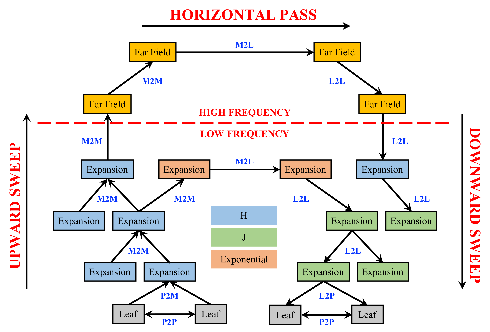
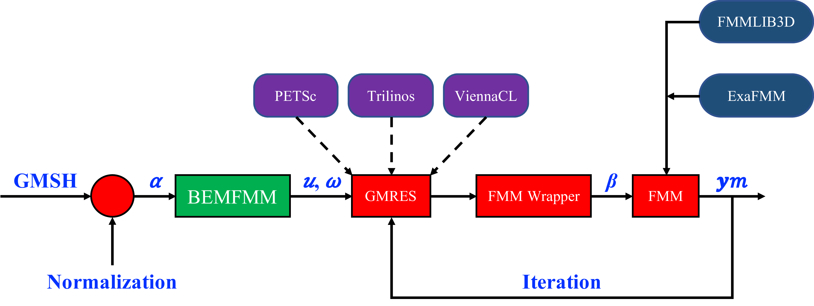

# BEMFMM [](https://badge.fury.io/gh/ecrc%2FBEMFMM) [](https://opensource.org/licenses/MIT) #

**BEMFMM** (https://ecrc.github.io/BEMFMM/) is an extreme-scale Fast Multipole Method (FMM)-accelerated Boundary Element Method (BEM) parallel solver framework. It is a boundary integral equation solver for wave scattering suited for many-core processors, which are expected to be the building blocks of energy-austere exascale systems, and on which algorithmic and architecture-oriented optimizations are essential for achieving worthy performance. It uses the GMRES iterative method and FMM to implement the MatVec kernel. The underlying kernels are highly optimized for both shared- and distributed-memory architectures. The solver framework features optimal architecture-specific1 and algorithm-aware partitioning, load balancing, and communication reducing mechanisms. To this end, BEMFMM framework provides a highly scalable FMM implementation that can be efficiently applied to the computation of the Helmholtz integral equation kernel. In particular, it deals with addressing the parallel challenges of such application, especially at extreme-scale settings, with emphasis on both shared- and distributed-memory performance optimization and tuning on emerging HPC infrastructures.

## The Underlying FMM Implementation ##



## System Workflow ##



## Requirements ##

* C/C++ Compiler (e.g., **GNU C/C++ Compiler** -- https://www.gnu.org/software/gcc/)
* MPI  (e.g., **MPICH** -- http://www.mpich.org/)
* LAPACK (e.g., **NETLIB LAPACK** -- http://www.netlib.org/lapack/)
* Intel TBB (https://www.threadingbuildingblocks.org/)
* ParMETIS (http://glaros.dtc.umn.edu/gkhome/metis/parmetis/overview)
* FORTRAN Compiler (e.g., **GNU FORTRAN Compiler** -- https://gcc.gnu.org/fortran/)[Note: You need a working **FORTRAN** compiler to be able to use LAPACK and BLAS. However, this requirements is not necessarily if you use the **C** implementation of **LAPACK** and **BLAS**. In addition, **BLAS** comes with **LAPACK** but you may need to install it separately. The current included archive of **LAPACK** and **BLAS** uses FORTRAN compiler. As such, if you are going to use the provided installation, then please make sure that your system has a working **FORTRAN** compiler, otherwise, you can link to your own installation.]

The repository includes **LAPACK**, **TBB**, and **ParMETIS**, and the default Makefile links to these. Thus, you may not need to install yours, you can just use the ones that are already included herein. However, if you have a better implementation that you wish to link to, just install it on your software environment and directly link to it.

Having said that and since the repository already included the required external libraries, the minimum requirements to run BEMFMM are:

* C/C++ Compiler (e.g., **GNU C/C++ Compiler** -- https://www.gnu.org/software/gcc/)
* MPI (e.g., **MPICH** -- http://www.mpich.org/)
* FORTRAN Compiler (e.g., **GNU FORTRAN Compiler** -- https://gcc.gnu.org/fortran/)

Please have these three dependencies configured and installed on your system before running the solver code.

## Compiling and Linking ##

Edit make.inc file to include all of your installed dependencies. The default ones are set to GNU GCC compiler with MPICH. If you have these two configured and installed on your system, then you may not need to edit the make.inc file. Anything that you do not want to include in the make, just comment it out in the make.inc. The Makefile, on the other hand, is dynamic, therefore, you do not need to change it. All of your changes must be directed to the make.inc file only. Even if you want to add additional compiler's flags, use **USERCXXFLAGS**, **USERLIBS**, **USERINCS** variables in the make.inc to include all of your flags. Once you edit the make.inc file, you can just do:

```bash
make clean
make all
```

`make` should generate an executable binary file called: **bemfmm_test_mpi**. You can run it directly with `mpirun` executable command. Please provide your command-line arguments. To learn about all of the available command-line arguments supplemented in our solver code, use `-h` or `--help`, which lists all of the available command-line arguments.

### Running Test Cases ###

To give you a flavor of the excepted outputs, you can use: `make test_serial`, for serial execution, or `make test_parallel`, for parallel execution. Note: You may need to add TBB library path to your **LD_LIBRARY_PATH**, before you run the executable. To do so, run the following bash command:

```bash
export LD_LIBRARY_PATH="TBB/lib:$LD_LIBRARY_PATH"
```

The example herein assumes that you are using the TBB implementation provided with BEMFMM. Hence, you may want to replace `TBB/lib` with your TBB library path.

## Tested Architectures ##

Here is a list of the systems in which we ran BEMFMM: [Note: For additional information, please read the [supplementary martial] document (docs/sisc_sub_20181111.pdf)]

* Shaheen Supercomputer at KAUST -- Cray XC40
  * GNU Programming Environment -- GCC and GFORTRAN version 7.2.0
  * Cray MPICH version 7.7.0
  * Used the repository provided library for TBB, ParMETIS, and LINPACK
* Intel Skylake Scalable Processor Server [56 Cores (dual-socket)]
  * Intel Parallel Studio 2018 Update 3
  * Intel ICPC
  * Intel IFORT
  * Intel MPI
  * Intel MKL
  * Intel TBB
  * Used the repository provided library for ParMETIS
* Intel Knights Landing Server [72 Cores and 64 Cores]
  * Intel Parallel Studio 2018 Update 1
  * Intel ICPC
  * Intel IFORT
  * Intel MPI
  * Intel MKL
  * Intel TBB
  * Used the repository provided library for ParMETIS
* Intel Haswell Server [36 Cores (dual-socket)]
  * Intel Parallel Studio 2018 Update 3
  * Intel ICPC
  * Intel IFORT
  * Intel MPI
  * Intel MKL
  * Intel TBB
  * Used the repository provided library for ParMETIS
* Intel IvyBridge Server [20 Cores (dual-socket)]
  * GNU GCC version 7.3.0
  * GNU GFORTRAN version 7.3.0
  * MPICH version 3.2
  * Used the repository provided library for TBB, ParMETIS, and LINPACK
* AMD EPYC Server [16 Cores (quad-socket)]
  * GNU GCC version 8.1.0
  * GNU GFORTRAN version 8.1.0
  * MPICH version 3.2
  * Used the repository provided library for TBB, ParMETIS, and LINPACK

## Control Parameters ##


## Contact ##

* mustafa.abduljabbar@kaust.edu.sa
* mohammed.farhan@kaust.edu.sa

## People ##

### Developers ###

* Mustafa Abduljabbar
* Mohammed Al Farhan

### Collaborators ###

* Noha Al-Harthi
* Rue Chen
* George Markomanolis
* Huda Ibeid
* Gustavo Chávez

### PIs ###

* Rio Yokota
* Hakan Bagci
* David Keyes

## License ###

MIT License

## Acknowledgments ##

Support in the form of computing resources was provided by KAUST Extreme Computing Research Center, KAUST Supercomputing Laboratory, KAUST Information Technology Research Division, Intel Parallel Computing Centers, and Cray Supercomputing Center of Excellence. In particular, the authors are very appreciative to Bilel Hadri of KAUST Supercomputer Laboratory for his great help and support throughout scalability experiments n the Shaheen supercomputer.

## Papers ##

* M. Abduljabbar, M. Al Farhan, N. Al-Harthi, R. Chen, R. Yokota, H. Bagci, and D. Keyes, *Extreme Scale FMM-Accelerated Boundary Integral Equation Solver for Wave Scattering*, submitted to SIAM Journal of Scientific Computing (SISC), 2018, arXiv: https://arxiv.org/abs/1803.09948. [Supplementary Material.](docs/sisc_sub_20181111.pdf).
* M. Abduljabbar, M. Al Farhan, R. Yokota, and D. Keyes, *Performance Evaluation of Computation and Communication Kernels of the Fast Multipole Method on Intel Manycore Architecture*, vol. 10417 of Lecture Notes in Computer Science, Springer International Publishing, Cham, 2017, pp. 553–564.
* M. Abduljabbar, G. S. Markomanolis, H. Ibeid, R. Yokota, and D. Keyes, *Communication Reducing Algorithms for Distributed Hierarchical N-Body Problems with Boundary Distributions*, vol. 10266 of Lecture Notes in Computer Science, Springer International Publishing, Cham, 2017, pp. 79–96.
* M. Abduljabbar and R. Yokota, *N-body methods*, in High Performance Parallelism Pearls, Morgan Kaufmann - Elsevier, Burlington MA, 2015, ch. 10.
* M. Abduljabbar, R. Yokota, and D. Keyes, *Asynchronous Execution of the Fast Multipole Method Using Charm++*, vol. abs/1405.7487 of CoRR, arXiv, 1405.7487, 2014, http://arxiv.org/abs/1405.7487.
